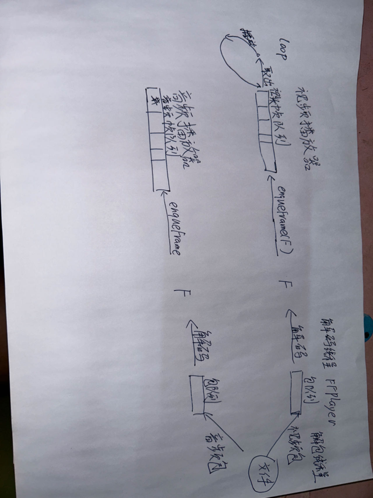

# 视频播放器

## 技术栈

QT, ffmpeg, PortAudio

## 架构

FFPlay负责读取一个视频文件，一个线程用来读取packet，接着两个线程分别用来解码音频和视频。

解码出来的Frame会通过插入到视频播放器或者音频播放器的队列中，视频播放器和音频播放器分别从队列中取出Frame进行播放。

视频播放器使用QPainter将一帧Frame绘制到QWidget上

音频播放器使用PortAudio播放音频，音频播放器会将解码出来的音频Frame转换成PortAudio的格式，然后通过PortAudio播放出来。

对于一些控制信息，会有一个中间层MediaPlayer，用来控制播放器的播放，暂停，快进，快退等操作。

